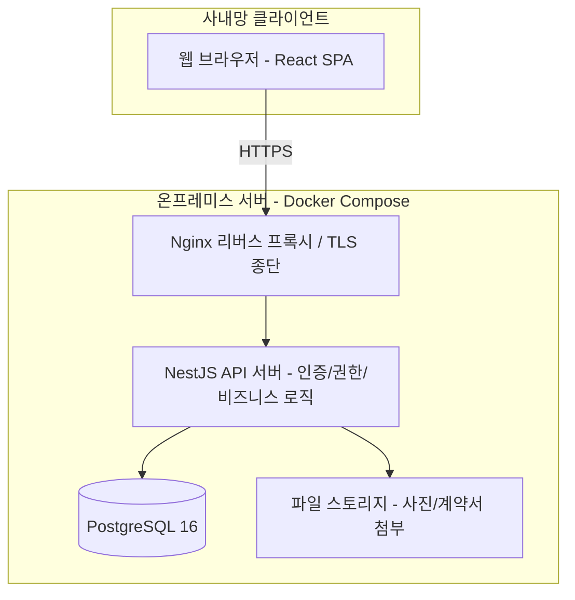
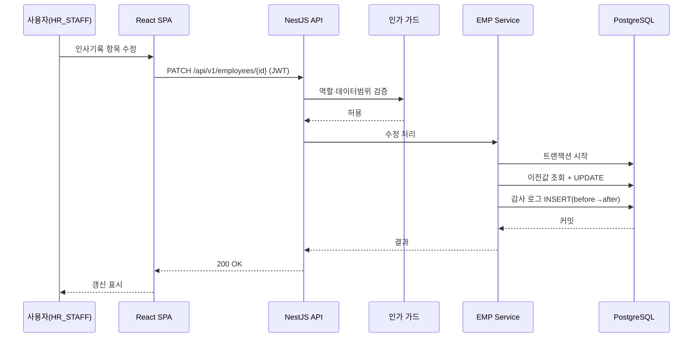
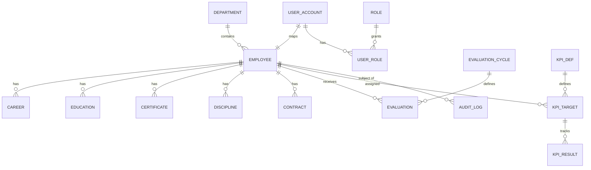
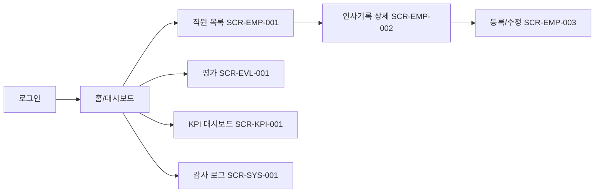

# HR 인사기록카드 시스템 — 프로그램 요구사항 명세서 (PRD)

> **개발 주체: AI 에이전트 모드** — 본 문서는 공유·합의 문서가 아니라 **실행 명세서(executable spec)** 입니다. AI는 모호한 부분을 질문하지 않고 가정으로 메꿔 구현하므로, 모든 요구사항은 "구현 완료를 기계적으로 판정할 수 있는 형태"로 기술했습니다.

---

## STEP 0. 사전 판단 결과

### 0.1 입력 정보 충분성 판단
초기 입력(프로그램명·기능 범위·사용자 그룹·개발 주체)만으로는 규모/이관/연동/인프라/규제 등 비즈니스 영향이 큰 항목이 미정이어서 문서의 50% 이상을 추론해야 하는 상태였습니다. 이에 PRD 작성 전 핵심 질문 4개를 먼저 확인했고, 아래 답변을 확보했습니다.

| 확인 항목 | 답변 |
|-----------|------|
| 대상 직원 규모 | **300~1,000명** |
| 기존 데이터/시스템 이관 | **신규 구축 (이관 없음)** |
| 필수 연동 대상 | **연동 없음 (독립 운영)** |
| 배포 환경 / 다국어 | **온프레미스 / 다국어(한국어·영어·베트남어)** |

확인된 4개 항목 외 나머지(보안 규제 수준, 목표 일정, 평가/KPI 업무 규칙 세부 등)는 합리적으로 추론하여 **[추론됨: 근거]** 로 표시하고, 비즈니스 영향이 큰 항목은 §24 Open Questions에 정리했습니다.

### 0.2 프로그램 티어 분류
**Tier 2 (전사 핵심 시스템)로 분류** — 전 직원 300~1,000명의 인사·평가·KPI 데이터를 다루는 전사 시스템이며, 인사기록은 개인정보(주민등록번호·연봉·평가 등 민감정보 포함)와 감사 추적이 핵심이므로.

- 작성 섹션: **전체** (단 §9 성능, §10 안정성, §15 배포는 규모에 맞게 축약)
- 비기능 요구: 가용성·감사추적 중심
- 목표 분량: 20~35페이지

### 0.3 개발 주체 모드
**AI 에이전트 모드** — 입력 정보에서 명시. 그에 따른 문서 구성:

| 항목 | 적용 |
|------|------|
| §17 일정 | Phase 계획 + 기계 판정 가능한 완료 기준 (§17-AI) |
| §18 리소스 | 사람 검토자 역할 + AI 도구/비용 (§18-AI) |
| §15.2 릴리스 | Phase 구현 → 자동 테스트 → **사람 검수 체크포인트** → 다음 Phase |
| §24 Open Questions | AI 작업 지시 전 **100% 해소 필수** |
| §25 AI 개발 거버넌스 | **활성화 (필수)** |
| 문서 산출물 | PRD + CLAUDE.md + Phase별 작업 지시서 분리 |

---

## 1. 문서 정보

| 항목 | 내용 |
|------|------|
| 문서 버전 | v1.0.0 |
| 작성일 | 2026-06-13 |
| 최종 수정일 | 2026-06-13 |
| 작성자 | AI 아키텍트 (Claude) |
| 검토자 | HR팀장 / IT 운영 담당 *(지정 필요)* |
| 승인자 | 경영진(HR 총괄) *(지정 필요)* |
| 문서 위치 | `git@<사내 Git>:hr/personnel-card-system.git` → `/docs/PRD.md` [추론됨: 온프레미스 환경의 사내 Git 저장소 가정] |
| 티어 분류 | **Tier 2 (전사 핵심 시스템)** — 300~1,000명 인사·민감정보 처리 전사 시스템 |
| 개발 주체 모드 | **AI 에이전트 모드** |

---

## 2. 프로그램 개요

### 2.1 프로그램 정보
- **정식 명칭**: HR 인사기록카드 시스템
- **코드명**: `pcard` (Personnel Card)
- **한 줄 설명**: 전 직원의 인사기록카드(기본정보·경력·교육·자격·상벌·계약 이력)와 연간 평가 기록 및 KPI를 통합 관리하는 온프레미스 사내 웹 시스템.
- **타입/카테고리**: 내부 시스템 / 온프레미스 / 웹 애플리케이션 / HRIS(인사정보시스템) 코어 모듈

### 2.2 개발 배경 및 목적
- **개발 필요성**: 인사기록이 엑셀·종이 문서로 분산 관리되어 최신성·정합성 확보가 어렵고, 평가·KPI 기록이 별도로 운영되어 인사 의사결정 시 통합 조회가 불가능함.
- **해결 문제**: ① 인사 정보 단일 출처(Single Source of Truth) 부재, ② 변경 이력·감사 추적 불가, ③ 평가/KPI와 기본 인사정보 연계 단절, ④ 다국어(베트남 현지 직원) 미지원.
- **기대 효과** [추론됨: 일반적 HRIS 도입 효과 기준, 실측 목표는 §20에서 확정 필요]:
  - 인사정보 조회·갱신 시간 월 약 40시간 절감 (HR팀 수기 취합 제거 가정)
  - 인사기록 정합성 오류율 90% 이상 감소 (입력 유효성 검증 적용)
  - 평가·KPI 집계 리드타임 단축 (수기 취합 → 시스템 집계)
- **차별점**: 기존 엑셀/수기 대비 — 항목 단위 유효성 검증, 변경 전후 감사 로그, 역할 기반 접근 통제, 평가·KPI 연계 조회, 다국어 UI.

### 2.3 대상 사용자 및 이해관계자

| 구분 | 역할 | 주요 사용 행위 |
|------|------|----------------|
| End User | **HR팀(HR_ADMIN)** | 전 직원 인사기록 등록·수정·조회, 평가/KPI 마스터 관리, 마스터 데이터 관리 |
| End User | **HR 담당자(HR_STAFF)** | 담당 범위 인사기록 입력·조회 (삭제·마스터 변경 불가) |
| End User | **부서장(MANAGER)** | 소속 부서 직원 인사기록(민감정보 제외) 조회, 평가 입력·KPI 등록 |
| End User | **경영진(EXECUTIVE)** | 전사 인사 현황·평가·KPI 통계 조회 (개별 민감정보 마스킹) |
| End User | **일반 직원(EMPLOYEE)** | 본인 인사기록 조회, 본인 정보 변경 요청 [추론됨: 셀프서비스 최소 범위, §24 Q7] |
| 시스템 관리자 | **SYS_ADMIN** | 계정·권한·코드·시스템 설정 관리, 감사 로그 조회 |
| 개발자/운영자 | 내부 IT팀 | 운영 이관 후 유지보수 |
| 기타 이해관계자 | 정보보호 책임자(CPO), 노무/법무 | 개인정보·노동 규제 준수 검토 |

---

## 3. 시스템 환경

### 3.1 실행 환경
- **프론트엔드**: React 18.x + TypeScript 5.x, Vite 빌드. 지원 브라우저: Chrome/Edge 최신 2개 버전, 사내 표준 브라우저 [추론됨: 사내 시스템이므로 IE 미지원, 모던 브라우저 한정]
- **백엔드**: Node.js 20 LTS + NestJS 10.x (TypeScript) [추론됨: 단일 언어(TS) 스택으로 AI 구현 일관성·유지보수성 확보]
- **서버**: **온프레미스** (사내 데이터센터 Linux 서버). 선택 근거: 입력 요건에서 온프레미스 지정 + 민감 인사정보의 사외 반출 제한.
- 운영 OS: Ubuntu Server 22.04 LTS [추론됨: 온프레미스 리눅스 표준]

### 3.2 개발 환경
- 언어: TypeScript 5.4+ (프론트/백 공통)
- 프레임워크: React 18.3, NestJS 10.3
- DB: PostgreSQL 16
- ORM: Prisma 5.x (마이그레이션 관리 내장)
- 빌드/패키지: Node 20, pnpm (lock 파일 고정)
- IDE/도구: VS Code, ESLint + Prettier
- 버전 관리: 사내 Git (Git Flow 경량 변형 — §15.3)

### 3.3 배포 환경
- **Tier 2 축약 적용**: Dev / Staging / Production **3단계** 유지(인사 데이터 특성상 운영 전 검증 필수).
- 컨테이너화: Docker Compose 기반 (Kubernetes 미채택 — 단일 사내 서버 규모에 과잉, §4.3에 확장 경로만 명시)
- CI/CD: 사내 GitLab CI 또는 GitHub Actions(self-hosted runner) [추론됨: 온프레미스 → self-hosted runner]
- 인프라 코드: Docker Compose + 환경별 `.env` (Terraform은 단일 서버에 과잉이라 미채택)

### 3.4 현장 환경 제약
- **네트워크**: 사내망(인트라넷) 한정 접근. 외부 인터넷 노출 금지. [추론됨: 인사 민감정보 보호 + 온프레미스]
- **전원/가동**: 업무시간(평일 08:00~20:00 KST/ICT) 중심 가용. 야간·주말은 점검 윈도우 활용 가능(일요일 02:00~06:00).
- **다국어 현장**: 베트남 현지 법인 직원 사용 가능성 → 베트남어 UI 및 ICT(베트남 표준시) 시간대 처리 필요. [추론됨: 다국어(한·영·베) 요건에서 도출, §24 Q5]
- **베트남 지역 제약**: 베트남 현지 직원 개인정보 처리 시 현지 규제 준수 필요 — 베트남 개인정보보호 법령(Decree 13/2023/ND-CP, 시행 2023-07-01) 적용. [추론됨 / 최신성 확인 필요: 베트남은 개인정보보호법(PDPL) 별도 입법이 진행되어 왔으므로 착수 전 현행 법령 재확인 필요 — §24 Q3]

---

## 4. 기능 요구사항

> **본 섹션이 PRD의 핵심입니다.**

기능 ID 체계: `F-<모듈>-<번호>`. 우선순위: P0(최우선)/P1(높음)/P2(중간).

### 4.1 핵심 기능 모듈 (Must-have)

#### 모듈 A. 직원/인사기록카드 관리 (EMP)
인사기록카드의 마스터. 직원 1명 = 인사기록카드 1건이며, 하위에 경력·교육·자격·상벌·계약 이력이 1:N으로 연결됨.

| 항목 | 내용 |
|------|------|
| **F-EMP-001 직원 등록** | |
| 입력 | 사번(자동/수동), 성명(한/영/현지어), 주민등록번호 또는 외국인등록번호, 생년월일, 성별, 입사일, 소속부서, 직급/직책, 고용형태(정규/계약/파견), 연락처, 이메일, 국적, 사진(선택) |
| 유효성 | 사번 UNIQUE, 주민번호 13자리 체크섬 검증(내국인)·여권/외국인번호 형식 검증(외국인), 이메일 RFC5322, 입사일 ≤ 오늘, 필수값 누락 시 거부 |
| 처리 | 트랜잭션 내 직원 레코드 생성 + 감사 로그 기록. 주민번호·연락처는 저장 시 AES-256 암호화 |
| 출력 | 생성된 사번·employee_id 반환, 201 |
| 예외 | 사번 중복(409), 주민번호 중복(409), 유효성 실패(400) |
| 권한 | HR_ADMIN, HR_STAFF |
| **F-EMP-002 인사기록 조회(상세)** | 단건 인사기록카드 전체 조회. 권한별 필드 마스킹 적용(§8.2). 권한: 전 역할(범위·마스킹 차등) |
| **F-EMP-003 인사기록 수정** | 항목 단위 수정, 변경 전후값 감사 로그 필수. 주민번호 등 핵심 식별자 변경은 HR_ADMIN만. 권한: HR_ADMIN, HR_STAFF(담당범위) |
| **F-EMP-004 직원 목록/검색** | 부서·직급·고용형태·재직상태·이름 필터, 페이지네이션(기본 20건). 권한별 조회 범위 제한. 권한: 전 역할(범위 차등) |
| **F-EMP-005 재직상태 변경(퇴사/휴직/복직)** | 상태 전이 규칙 적용: 재직→휴직→복직, 재직→퇴사(불가역). 퇴사 처리 시 퇴사일 기록. **퇴사자 조회 규칙: 퇴사일 +90일까지 HR_ADMIN·HR_STAFF만 조회 가능, 이후 개인정보 항목 마스킹 보관(법정 보존기간 동안)**. 권한: HR_ADMIN |

- **모듈 의존성**: 모든 하위 이력 모듈(B~F)의 부모. 인증/권한(모듈 H) 선행.
- **우선순위**: P0

#### 모듈 B. 경력 이력 (CAR)
| 기능 | 설명 / 입출력 요약 | 권한 |
|------|---------------------|------|
| F-CAR-001 경력 등록 | 입력: 회사명·부서·직위·담당업무·시작일·종료일(또는 재직중). 유효성: 시작일 ≤ 종료일. 처리: 기간 중복 경고(비차단). | HR_ADMIN, HR_STAFF |
| F-CAR-002 경력 수정/삭제 | 소프트 삭제(deleted_at), 감사 로그. | HR_ADMIN, HR_STAFF |
| F-CAR-003 경력 목록 조회 | 직원별 경력 시간순 정렬. | 범위 차등 전 역할 |

우선순위: P0

#### 모듈 C. 교육 이력 (EDU)
| 기능 | 설명 / 입출력 요약 | 권한 |
|------|---------------------|------|
| F-EDU-001 교육 등록 | 입력: 교육명·기관·구분(사내/사외/법정의무)·수료일·이수시간·수료여부. 유효성: 이수시간 ≥ 0. | HR_ADMIN, HR_STAFF |
| F-EDU-002 교육 수정/삭제 | 소프트 삭제, 감사 로그. | HR_ADMIN, HR_STAFF |
| F-EDU-003 법정의무교육 이수 현황 | 연도별 법정교육 이수 여부 집계 조회. | HR_ADMIN, MANAGER(부서), EXECUTIVE(통계) |

우선순위: P0(등록/조회), P1(법정의무 집계)

#### 모듈 D. 자격/면허 (CRT)
| 기능 | 설명 / 입출력 요약 | 권한 |
|------|---------------------|------|
| F-CRT-001 자격 등록 | 입력: 자격명·발급기관·취득일·만료일(선택)·자격번호. 처리: 만료일 임박(30일 이내) 시 알림 대상 표시. | HR_ADMIN, HR_STAFF |
| F-CRT-002 자격 수정/삭제 | 소프트 삭제, 감사 로그. | HR_ADMIN, HR_STAFF |
| F-CRT-003 만료 임박 자격 조회 | 만료 30/60/90일 이내 자격 목록. | HR_ADMIN, MANAGER(부서) |

우선순위: P0(등록/조회), P1(만료 알림)

#### 모듈 E. 상벌 이력 (DSC)
| 기능 | 설명 / 입출력 요약 | 권한 |
|------|---------------------|------|
| F-DSC-001 상벌 등록 | 입력: 구분(포상/징계)·사유·일자·근거문서·처분내용. 민감 항목으로 분류. | HR_ADMIN |
| F-DSC-002 상벌 조회 | 본인/부서장은 조회 제한(HR_ADMIN·해당 본인 일부만). | HR_ADMIN, 본인(포상만) |
| F-DSC-003 상벌 수정/삭제 | 소프트 삭제, 감사 로그 강화(상벌은 변경 사유 필수 입력). | HR_ADMIN |

우선순위: P0

#### 모듈 F. 계약 이력 (CON)
| 기능 | 설명 / 입출력 요약 | 권한 |
|------|---------------------|------|
| F-CON-001 계약 등록 | 입력: 계약유형(정규/계약/연봉계약)·계약시작일·종료일·연봉(민감)·근무지·계약서 첨부. | HR_ADMIN |
| F-CON-002 계약 수정/갱신 | 갱신 시 신규 계약 레코드 생성(이력 보존). 연봉 변경 감사 로그. | HR_ADMIN |
| F-CON-003 계약 만료 임박 조회 | 만료 30/60/90일 이내 계약 직원 목록. | HR_ADMIN, MANAGER(부서) |

우선순위: P0

#### 모듈 G. 연간 평가 기록 (EVL)
연 1회 이상 인사평가 기록을 관리. 평가 마스터(평가주기·항목·등급 체계)는 HR_ADMIN이 설정.

| 항목 | 내용 |
|------|------|
| **F-EVL-001 평가주기 설정** | 입력: 평가연도·평가유형(연간/반기)·평가항목 세트·등급체계(예: S/A/B/C/D)·기간. 권한: HR_ADMIN |
| **F-EVL-002 평가 입력** | 입력: 대상직원·평가항목별 점수·등급·평가의견. 처리: 1차(부서장)→2차(상위) 단계 평가, 점수 합산·등급 산출(가중치 적용). 유효성: 점수 범위 검증. 권한: MANAGER(1차, 소속부서), HR_ADMIN(2차/조정) |
| **F-EVL-003 평가 조회** | 본인은 확정된 본인 평가만 조회. 부서장은 소속 직원, 경영진은 통계. 권한: 범위 차등 |
| **F-EVL-004 평가 확정/이의신청** | 확정 후 잠금(편집 불가), 이의신청 기록. 권한: HR_ADMIN(확정), 본인(이의신청) [추론됨: 평가 워크플로우 표준, §24 Q4] |
| **F-EVL-005 연도별 평가 이력 조회** | 직원별 평가 등급 추이(연도순). 권한: HR_ADMIN, MANAGER(부서), 본인 |

- 의존성: 모듈 A(직원), 모듈 I(KPI 연계 가능)
- 우선순위: P0(설정·입력·조회), P1(이의신청)

#### 모듈 H. 인증 및 권한 (AUTH)
| 기능 | 설명 | 권한 |
|------|------|------|
| F-AUTH-001 로그인 | 사번/이메일 + 비밀번호. JWT 발급. 5회 실패 시 계정 잠금(15분). | 전체 |
| F-AUTH-002 로그아웃/토큰 갱신 | Refresh 토큰 회전. | 인증 사용자 |
| F-AUTH-003 비밀번호 정책/변경 | 최소 10자·영문·숫자·특수문자, 90일 변경 권고, 최근 3개 재사용 금지. | 인증 사용자 |
| F-AUTH-004 역할/권한 관리 | 역할 부여·회수, 권한 매트릭스(§8.2) 적용. | SYS_ADMIN, HR_ADMIN |
| F-AUTH-005 접근 제어 | 역할×기능 매트릭스 기반 인가, 데이터 범위 필터(본인/부서/전사). | 시스템 |

우선순위: P0

#### 모듈 I. KPI 관리 (KPI)
| 항목 | 내용 |
|------|------|
| **F-KPI-001 KPI 항목 정의** | 입력: KPI명·설명·측정단위·목표값·가중치·평가연도·적용대상(전사/부서/개인). 권한: HR_ADMIN, EXECUTIVE(승인) |
| **F-KPI-002 KPI 목표 배정** | 직원/부서별 KPI 목표 설정. 가중치 합 = 100% 검증. 권한: MANAGER(소속), HR_ADMIN |
| **F-KPI-003 KPI 실적 입력** | 기간별 실적 입력, 달성률 자동 계산(실적/목표×100, 가중 환산). 권한: MANAGER, 본인(입력)·HR_ADMIN(확정) |
| **F-KPI-004 KPI 대시보드** | 개인/부서/전사 달성률 집계·시각화. 권한: 범위 차등(본인/부서/전사) |
| **F-KPI-005 KPI-평가 연계** | KPI 달성률을 평가(EVL) 항목에 반영(연동 옵션). 권한: HR_ADMIN |

- 의존성: 모듈 A, 모듈 G
- 우선순위: P0(정의·배정·실적·대시보드), P1(평가 연계)

#### 모듈 J. 감사 로그 & 공통 (SYS)
| 기능 | 설명 | 권한 |
|------|------|------|
| F-SYS-001 감사 로그 기록 | 모든 생성/수정/삭제에 대해 누가/언제/무엇을/이전값→이후값 기록(자동). | 시스템 |
| F-SYS-002 감사 로그 조회 | 대상·사용자·기간 필터 조회. | SYS_ADMIN, HR_ADMIN |
| F-SYS-003 코드/마스터 관리 | 부서·직급·고용형태·자격종류 등 공통코드 관리. | SYS_ADMIN, HR_ADMIN |
| F-SYS-004 다국어 리소스 | UI 문자열 한/영/베 관리. | SYS_ADMIN |

우선순위: P0

### 4.2 부가 기능 모듈 (Should-have)
- **F-RPT-001 인사 통계 리포트**: 부서별 인원·근속·평가 분포 등 통계 화면 및 Excel 내보내기. 권한: HR_ADMIN, EXECUTIVE. 우선순위 P1.
- **F-NOTI-001 알림**: 자격/계약 만료 임박, 법정교육 미이수, 평가 마감 임박 사내 알림(시스템 내 알림함 + 이메일은 §11.3 조건부). 우선순위 P1.
- **F-EMP-101 셀프서비스 정보변경 요청**: 직원 본인 연락처·주소 변경 요청 → HR 승인. 우선순위 P1. [추론됨: §24 Q7]
- **F-EXP-001 인사기록카드 PDF 출력**: 표준 인사기록카드 양식 PDF 생성. 우선순위 P1.

### 4.3 향후 고려 기능 (Nice-to-have)
- **그룹웨어/ERP 연동(SSO·조직도·급여)**: 별도 시스템 도입 또는 통합 결정 시. (현재 연동 없음)
- **근태/출입 시스템 연동**: 현장 단말 도입 시.
- **Kubernetes 전환 / 다중 서버 확장**: 동시 사용자가 산정치를 크게 초과할 경우.
- **모바일 전용 앱**: 현재는 반응형 웹으로 대응.

### 4.4 기능별 예상 개발 공수

| 모듈/기능 | 복잡도 | 예상 공수(인일) | 담당 역할 | 우선순위 |
|-----------|--------|------------------|-----------|----------|
| 프로젝트 골격·CI(Phase 0) | 중 | 3 | AI+검수자 | P0 |
| DB 스키마·시드(Phase 1) | 중 | 4 | AI | P0 |
| 인증/권한 H | 중 | 5 | AI | P0 |
| 직원/인사기록 A | 상 | 8 | AI | P0 |
| 이력 B~F | 상 | 10 | AI | P0 |
| 평가 G | 상 | 7 | AI | P0 |
| KPI I | 상 | 7 | AI | P0 |
| 감사/공통 J | 중 | 4 | AI | P0 |
| 다국어·UX 정리 | 중 | 5 | AI | P1 |
| 통합/성능/보안 점검 | 중 | 4 | AI+검수자 | P0 |
| 배포·운영문서 | 중 | 3 | AI+운영 | P0 |
| **합계(P0 핵심)** | | **약 60 인일** | | |

> 공수는 AI 구현 + 사람 검수 사이클 기준의 추정치입니다. [추론됨: Tier 2 신규구축, P0 범위 기준. 부가기능(§4.2)은 별도]

---

## 5. 시스템 아키텍처

### 5.1 고수준 아키텍처
모놀리식(단일 백엔드 + SPA 프론트) 채택 — 단일 사내 서버, 300~1,000명 규모에 마이크로서비스는 과잉. 확장 경로만 §4.3에 보존.


*그림 5-1: 사내망 내 단일 서버 모놀리식 구성. 외부 인터넷 비노출.*

### 5.2 컴포넌트 구조
- 레이어: Presentation(React) / API(NestJS Controller) / Business(Service) / Data Access(Prisma Repository)
- 통신: 프론트↔백 REST/JSON over HTTPS, 백↔DB Prisma
- 디자인 패턴: 백엔드 모듈형 Clean Architecture(Controller-Service-Repository), 프론트 컴포넌트 + 상태관리(§12.1)
- 횡단 관심사: 인증 가드, 역할 인가 가드, 감사 로그 인터셉터, 에러 필터, i18n 미들웨어

### 5.3 데이터 흐름 (예: 인사기록 수정)


*그림 5-2: 모든 변경은 트랜잭션 내에서 감사 로그와 함께 기록됨.*

---

## 6. 데이터베이스 설계

### 6.1 데이터베이스 선택
**PostgreSQL 16** — 관계형 무결성(직원-이력 1:N FK), 트랜잭션, 행 수준 보안 잠재 활용, 컬럼 암호화(pgcrypto) 지원. NoSQL 불필요(정형 인사 데이터).

### 6.2 데이터 모델링


*그림 6-1: 핵심 엔티티 관계. EMPLOYEE가 모든 이력의 부모.*

**주요 테이블 정의 (발췌)**

`employee` (직원/인사기록카드 마스터)

| 컬럼명 | 타입 | NULL | 기본값 | 제약 | 설명 |
|--------|------|------|--------|------|------|
| id | BIGSERIAL | N | | PK | 내부 식별자 |
| emp_no | VARCHAR(20) | N | | UNIQUE | 사번 |
| name_ko | VARCHAR(50) | N | | | 성명(한글) |
| name_en | VARCHAR(100) | Y | | | 성명(영문) |
| name_local | VARCHAR(100) | Y | | | 현지어명(베트남어 등) |
| rrn_enc | BYTEA | N | | 암호화 | 주민/외국인등록번호(AES-256) |
| birth_date | DATE | N | | | 생년월일 |
| gender | CHAR(1) | Y | | CHECK(M/F) | 성별 |
| dept_id | BIGINT | N | | FK→department | 소속부서 |
| grade_code | VARCHAR(20) | Y | | FK→code | 직급 |
| employment_type | VARCHAR(20) | N | | CHECK | 고용형태(REGULAR/CONTRACT/DISPATCH) |
| hire_date | DATE | N | | | 입사일 |
| status | VARCHAR(20) | N | 'ACTIVE' | CHECK | 재직상태(ACTIVE/LEAVE/RESIGNED) |
| resign_date | DATE | Y | | | 퇴사일 |
| phone_enc | BYTEA | Y | | 암호화 | 연락처 |
| email | VARCHAR(120) | Y | | | 이메일 |
| nationality | VARCHAR(2) | Y | 'KR' | | 국적(ISO) |
| photo_path | VARCHAR(255) | Y | | | 사진 경로 |
| created_at | TIMESTAMPTZ | N | now() | | 생성시각(UTC) |
| updated_at | TIMESTAMPTZ | N | now() | | 수정시각 |
| deleted_at | TIMESTAMPTZ | Y | | | 소프트 삭제 |

`audit_log` (감사 로그)

| 컬럼명 | 타입 | NULL | 제약 | 설명 |
|--------|------|------|------|------|
| id | BIGSERIAL | N | PK | |
| actor_user_id | BIGINT | N | FK | 수행자 |
| action | VARCHAR(20) | N | CHECK | CREATE/UPDATE/DELETE/READ(민감) |
| entity | VARCHAR(50) | N | | 대상 테이블 |
| entity_id | BIGINT | N | | 대상 PK |
| before_json | JSONB | Y | | 이전값 |
| after_json | JSONB | Y | | 이후값 |
| reason | VARCHAR(255) | Y | | 변경 사유(상벌 등 필수) |
| created_at | TIMESTAMPTZ | N | | 발생시각(UTC) |

> 이력 테이블(`career`, `education`, `certificate`, `discipline`, `contract`)은 공통적으로 `id, employee_id(FK), ...항목..., created_at, updated_at, deleted_at`를 가지며 컬럼 단위 정의는 Phase 1 작업 지시서에서 전체 명세함.

**인덱스 정의(예시)**

| 인덱스명 | 대상 | 유형 | 근거 |
|----------|------|------|------|
| ux_employee_emp_no | employee(emp_no) | Unique | 사번 조회·중복 방지 |
| ix_employee_dept_status | employee(dept_id, status) | Composite B-tree | 부서별 재직자 목록 빈번 |
| ix_audit_entity | audit_log(entity, entity_id) | Composite | 대상별 변경 이력 추적 |
| ix_eval_emp_year | evaluation(employee_id, year) | Composite | 연도별 평가 조회 |

**민감 데이터(암호화 대상)**: `rrn_enc`(주민/외국인번호), `phone_enc`(연락처), `contract.salary`(연봉), `discipline`(상벌 사유). 모두 저장 시 AES-256, 표시 시 권한별 마스킹.

### 6.3 데이터 마이그레이션 전략
- 스키마 버전 관리: **Prisma Migrate** (마이그레이션 파일로만 스키마 변경, 운영 DB 직접 변경 금지 — §25.3)
- 기존 데이터 이관: **없음(신규 구축)**. 단, 초기 부서/직급/공통코드 마스터는 시드 스크립트로 적재.
- 롤백: 마이그레이션 down 스크립트 + 배포 전 DB 스냅샷.

### 6.4 데이터 백업 및 복구
- 백업: 일 1회 전체 + 6시간 간격 증분(pg_dump/WAL 아카이빙). [추론됨: Tier 2 사내 시스템 표준]
- 목표: **RPO ≤ 6시간, RTO ≤ 4시간** [추론됨: 업무시간 가용·온프레미스 단일서버 복구 현실치]
- 아카이빙/법정 보존: 인사기록은 관련 법령에 따라 보존. **근로 관계 서류는 근로기준법상 3년 보존**(근로계약·임금대장 등), 퇴사자 개인정보는 보존기간 경과 후 파기/마스킹. [추론됨 / §24 Q3에서 보존정책 확정 필요]

---

## 7. API 설계

### 7.1 API 스타일
- **REST / JSON**, URI 버저닝(`/api/v1`). 인증: JWT Bearer.
- 표준 에러 포맷: `{ "code": "EMP_DUPLICATE", "message": "...", "details": [] }`

### 7.2 주요 API 엔드포인트 (핵심 12개 발췌)

| # | 엔드포인트 | 설명 | 권한 |
|---|-----------|------|------|
| 1 | `POST /api/v1/auth/login` | 로그인, JWT 발급 | 전체 |
| 2 | `POST /api/v1/auth/refresh` | 토큰 갱신 | 인증 |
| 3 | `POST /api/v1/employees` | 직원 등록 | HR_ADMIN, HR_STAFF |
| 4 | `GET /api/v1/employees` | 직원 목록/검색 | 범위 차등 |
| 5 | `GET /api/v1/employees/{id}` | 인사기록 상세 | 범위·마스킹 차등 |
| 6 | `PATCH /api/v1/employees/{id}` | 인사기록 수정 | HR_ADMIN, HR_STAFF |
| 7 | `POST /api/v1/employees/{id}/careers` | 경력 등록 | HR_ADMIN, HR_STAFF |
| 8 | `POST /api/v1/employees/{id}/contracts` | 계약 등록 | HR_ADMIN |
| 9 | `POST /api/v1/evaluations` | 평가 입력 | MANAGER, HR_ADMIN |
| 10 | `GET /api/v1/evaluations?employeeId=&year=` | 평가 조회 | 범위 차등 |
| 11 | `POST /api/v1/kpi/results` | KPI 실적 입력 | MANAGER, 본인 |
| 12 | `GET /api/v1/kpi/dashboard?scope=` | KPI 대시보드 | 범위 차등 |
| 13 | `GET /api/v1/audit-logs` | 감사 로그 조회 | SYS_ADMIN, HR_ADMIN |

**상세 명세 예시 — `POST /api/v1/employees`**

| 항목 | 내용 |
|------|------|
| 권한 | HR_ADMIN, HR_STAFF |
| 요청 헤더 | `Authorization: Bearer {token}`, `Content-Type: application/json`, `Accept-Language: ko|en|vi` |
| 요청 본문 | `{ "empNo": "string?", "nameKo": "string(required)", "nameEn": "string?", "rrn": "string(required)", "birthDate": "YYYY-MM-DD", "deptId": "number(required)", "employmentType": "REGULAR|CONTRACT|DISPATCH", "hireDate": "YYYY-MM-DD", "email": "string?" }` |
| 성공 응답 | `201 Created` → `{ "id": 1024, "empNo": "20260123" }` |
| 에러 응답 | `400` 유효성 실패 `{code:"VALIDATION_ERROR", details:[...]}` / `401` 미인증 / `403` 권한 없음 / `409` 사번·주민번호 중복 `{code:"EMP_DUPLICATE"}` |

**상세 명세 예시 — `GET /api/v1/employees/{id}`**

| 항목 | 내용 |
|------|------|
| 권한 | 전 역할(범위·마스킹 차등): EMPLOYEE는 본인만, MANAGER는 소속부서, HR은 전사 |
| 성공 응답 | `200 OK` + 인사기록카드 JSON(권한별 필드 마스킹: 비권한자에게 `rrn`은 `******-*******`) |
| 에러 응답 | `401` / `403`(범위 밖 접근) / `404`(미존재 또는 마스킹 보관 대상) |

### 7.3 API 문서화
- OpenAPI 3.0 (NestJS Swagger 자동 생성) → `/api/docs` (사내망·인증 한정)
- 인증/인가: JWT, 역할 가드. 샘플 요청/응답 Swagger에 포함.

---

## 8. 인증 및 보안

### 8.1 인증
- 방식: **JWT (Access 30분 + Refresh 8시간, 회전)**. 자체 계정 기반. [추론됨: 연동 없음 → SSO 미적용. 향후 AD 연동은 §4.3]
- MFA: Tier 2 사내망 한정이므로 기본 미적용, HR_ADMIN/SYS_ADMIN 계정은 향후 옵션. [추론됨, §24 Q6]
- 계정 잠금: 로그인 5회 실패 → 15분 잠금.

### 8.2 인가 — 역할×기능 권한 매트릭스

| 기능 영역 | EMPLOYEE | MANAGER | HR_STAFF | HR_ADMIN | EXECUTIVE | SYS_ADMIN |
|-----------|----------|---------|----------|----------|-----------|-----------|
| 본인 인사기록 조회 | ✅ | ✅ | ✅ | ✅ | ✅ | ✅ |
| 타인 인사기록 조회 | ❌ | 소속부서 | 담당범위 | 전사 | 전사(마스킹) | ❌ |
| 인사기록 등록/수정 | 요청만 | ❌ | 담당범위 | 전사 | ❌ | ❌ |
| 민감정보(주민번호/연봉) | 본인 마스킹 | ❌ | 일부 | ✅ | 마스킹 | ❌ |
| 상벌 관리 | 포상 본인 | ❌ | ❌ | ✅ | ❌ | ❌ |
| 평가 입력 | ❌ | 1차(소속) | ❌ | 2차/조정 | ❌ | ❌ |
| 평가 조회 | 본인 확정분 | 소속부서 | ❌ | 전사 | 통계 | ❌ |
| KPI 실적 입력 | 본인 | 소속부서 | ❌ | 전사 | ❌ | ❌ |
| KPI 대시보드 | 본인 | 부서 | 부서 | 전사 | 전사 | ❌ |
| 계정/권한/코드 관리 | ❌ | ❌ | ❌ | 일부 | ❌ | ✅ |
| 감사 로그 조회 | ❌ | ❌ | ❌ | ✅ | ❌ | ✅ |

- 모델: **RBAC** + 데이터 범위 필터(본인/부서/전사). 리소스별 행 수준 통제(예: MANAGER는 `dept_id` 일치 행만).

### 8.3 보안 요구사항
- 암호화: 전송 TLS 1.2+ (사내 CA 인증서), 저장 AES-256(주민/외국인번호·연락처·연봉·상벌사유), 비밀번호 bcrypt(cost≥12).
- 웹 취약점 방어: SQL Injection(Prisma 파라미터 바인딩), XSS(출력 이스케이프·CSP), CSRF(SameSite 쿠키 또는 토큰), 입력 검증(class-validator).
- 보안 헤더: CSP, HSTS, X-Content-Type-Options, X-Frame-Options(DENY), CORS(사내 오리진 화이트리스트).
- **개인정보 항목 목록 및 근거 법령**:

| 개인정보 항목 | 분류 | 근거 법령 |
|---------------|------|-----------|
| 주민등록번호 | 고유식별정보(민감) | 한국 개인정보보호법(PIPA) §24의2 — 별도 저장·암호화 의무 |
| 외국인등록번호/여권 | 고유식별정보 | 한국 PIPA / 베트남 Decree 13/2023/ND-CP(현지 직원) |
| 연봉·급여 | 민감 | PIPA 일반 개인정보, 접근통제 강화 |
| 상벌·평가 | 민감 | PIPA, 근로 관련 내부 통제 |
| 건강/병역 등 | (현재 범위 외) | 수집 시 별도 동의 필요 |

- 감사 추적: 누가/언제/무엇을/이전값→이후값(`audit_log`). 인사·평가 데이터 변경은 필수 기록.
- 보안 테스트: OWASP Top 10 점검(§14.1) — 개인정보 취급으로 필수.

---

## 9. 성능 요구사항 (Tier 2 축약)

> 아래 수치는 산정 근거를 병기한 목표치입니다.

### 9.1 응답 시간
- 일반 조회 API: **P95 ≤ 500ms** (단순 인덱스 조회 기준)
- 목록/검색 API: **P95 ≤ 800ms** (페이지네이션 20건)
- 페이지 초기 로딩: ≤ 2.5초 (사내망)
- 산정 근거: 사내망·중소 데이터량(직원 ≤1,000, 이력 수만 행)에서 인덱스 조회로 충분히 달성 가능.

### 9.2 처리량
- 동시 접속자: **약 60~100명** (산정: 직원 1,000명 × 동시 사용률 약 8~10%. HR 업무 특성상 상시 동시 사용률 낮음). 피크: 평가·KPI 마감 주간.
- RPS: 평시 낮음, 피크 시 ≈ 30 RPS 대비 설계. [추론됨: 동시 100명 × 사용자당 분당 약 18요청]

### 9.3 확장성 (Tier 2)
- 기본 단일 서버 수직 확장으로 충분. 수평 확장(API 다중화 + 로드밸런서)은 확장 경로로만 보존(§4.3). DB 샤딩/멀티리전 **미적용**(규모 과잉).
- 캐싱: 공통코드·다국어 리소스 인메모리 캐시. Redis는 현 규모 불필요(필요 시 도입).

### 9.4 성능 최적화
- 쿼리: §6.2 인덱스, N+1 방지(Prisma include 최적화).
- 목록 페이지네이션·Lazy Loading, 프론트 번들 코드 스플리팅.

---

## 10. 안정성 및 가용성 (Tier 2 축약)

### 10.1 가용성 목표
- SLA: **업무시간(평일 08:00~20:00) 99.5%** [추론됨: 사내 시스템·온프레미스 단일서버 현실치]. 야간/주말 점검 윈도우 허용.
- RTO ≤ 4시간, RPO ≤ 6시간 (§6.4와 일치).

### 10.2 장애 대응
- Health Check: `GET /api/v1/health`(DB 연결 포함).
- Retry/Timeout: DB 연결 풀 타임아웃, 트랜잭션 실패 시 롤백.
- Graceful Degradation: 통계/대시보드 등 비핵심 기능 장애 시 핵심 조회는 유지.
- (외부 연동 없음 → Circuit Breaker 미적용)

### 10.3 모니터링 및 알림
- 메트릭/로그: 컨테이너 로그 + PostgreSQL 로그, 경량 모니터링(예: Docker stats + cron 헬스체크). [추론됨: 단일서버, 사내 모니터링 스택 우선]
- 알림: 장애 시 담당자 이메일/사내 메신저 1~2인 알림(§16.3).

---

## 11. 외부 연동

### 11.1 외부 시스템 연동
**현재 범위: 외부 시스템 연동 없음 (독립 운영).** 향후 SSO·ERP·근태 연동은 §4.3 확장 경로로만 보존.

### 11.2 설비/장비 연동
해당 없음(현 범위). 향후 근태 단말·출입 연동 시 §4.3.

### 11.3 제3자 서비스/라이브러리
- 이메일 알림(자격/계약 만료, 평가 마감): **사내 SMTP 서버 경유**(외부 SaaS 미사용, 온프레미스 정책). 미구축 시 시스템 내 알림함으로 대체. [추론됨, §24 Q5]
- 오픈소스 라이브러리는 §25.1 스택 고정 목록으로 통제(라이선스: MIT/Apache 계열 한정).

---

## 12. 사용자 인터페이스 (UI/UX)

### 12.1 UI 프레임워크
- React 18 + TypeScript, UI 라이브러리 **MUI(Material-UI) 5.x** [추론됨: 폼·테이블 중심 관리 화면에 적합, 컴포넌트 풍부]
- 상태관리: TanStack Query(서버 상태) + Zustand(클라이언트 경량 상태)
- 다국어: react-i18next

### 12.2 화면 설계 (주요 화면)

| 화면 ID | 이름 | 목적 |
|---------|------|------|
| SCR-EMP-001 | 직원 목록 | 검색·필터·페이지네이션, 신규 등록 진입 |
| SCR-EMP-002 | 인사기록카드 상세 | 기본정보 + 탭(경력/교육/자격/상벌/계약) |
| SCR-EMP-003 | 인사기록 등록/수정 폼 | 유효성 실시간 검증 |
| SCR-EVL-001 | 평가 입력/조회 | 평가항목·등급·의견 |
| SCR-KPI-001 | KPI 대시보드 | 달성률 시각화(차트) |
| SCR-SYS-001 | 감사 로그 조회 | 필터·상세 |


*그림 12-1: 주요 화면 흐름.*

인사기록카드 상세(SCR-EMP-002) 텍스트 와이어프레임:
```
[사진] 성명(한/영/현지)  사번  소속/직급  재직상태
------------------------------------------------
[탭] 기본정보 | 경력 | 교육 | 자격 | 상벌 | 계약 | 평가 | KPI
------------------------------------------------
선택 탭 내용(목록 테이블 + [추가] 버튼, 권한 시)
------------------------------------------------
[수정] [PDF 출력]   (변경 시 감사 로그 기록 안내)
```

### 12.3 반응형 디자인
- Desktop 우선(HR 업무), Tablet 대응. 브레이크포인트: 1280/768.
- 현장 단말(산업용 태블릿) 가독성 고려한 폰트·터치 타깃. [추론됨: 베트남 현장 직원 조회 가능성]

### 12.4 접근성
- Tier 2 사내 시스템 → 기본 키보드 네비게이션·색상 대비 준수. WCAG 2.1 AA 전면 준수는 범위 외(§22).

---

## 13. 다국어 및 지역화

### 13.1 지원 언어
- **한국어(기본), 영어, 베트남어**. 사용자 그룹: 관리자·HR=한국어, 본사 일부=영어, 베트남 현지 직원=베트남어. [추론됨: 다국어 요건에서 도출]

### 13.2 국제화(i18n)
- react-i18next, 번역 파일 `locales/{ko,en,vi}/*.json`. 번역 책임자 지정 필요(§24 Q5).
- 형식: 날짜(YYYY-MM-DD), 통화(KRW/VND/USD 표기), 숫자 로캘.

### 13.3 시간대 처리
- 서버 저장 **UTC**, 표시 시 클라이언트 로캘(KST/ICT) 변환. 입사일·평가기간 등 날짜 경계 주의(ICT=UTC+7, KST=UTC+9).

---

## 14. 테스트 전략

### 14.1 테스트 유형 및 커버리지
- 단위 테스트(Jest): 핵심 비즈니스 로직 커버리지 **70% 이상**(권한·유효성·계산식 우선).
- 통합 테스트: 주요 API + DB(테스트 컨테이너).
- E2E(Playwright): 핵심 시나리오(직원 등록→이력 추가→평가→KPI).
- 성능 테스트(k6): §9 목표 대비 — 동시 100명·P95 검증.
- 보안 테스트: OWASP Top 10 점검 + 권한 우회 테스트 — **개인정보 취급으로 필수**.

### 14.2 테스트 자동화
- CI 파이프라인에서 단위·통합 자동 실행, 실패 시 배포 중단.

### 14.3 UAT
- 시나리오 기반(예: "신규 입사자 1명 전체 등록 → 평가·KPI 배정 → 부서장 조회 권한 확인").
- HR 도메인 전문가 검증, 피드백 반영 후 운영 승인.

---

## 15. 배포 전략 (Tier 2 축약)

### 15.1 배포 방식
- 단일 서버 점검 윈도우(일요일 새벽) Rolling 재기동. Blue-Green/Canary는 단일서버 규모에 과잉이라 미적용.

### 15.2 릴리스 프로세스 — AI 에이전트 모드
코드 리뷰가 내장되지 않으므로 **사람 검수 체크포인트를 구조화**:

1. AI가 Phase 단위 구현
2. 자동 테스트 전체 통과(실패 시 AI 수정 반복)
3. **사람 검수 체크포인트**: Phase 완료 기준(§17-AI) 대비 확인 + 핵심 코드 샘플 검토 + 실제 화면/API/권한 동작 확인
4. 검수 통과 시에만 다음 Phase 착수 승인
5. 전체 Phase 완료 후 Staging 검증
6. Production 배포(운영 담당이 직접 수행/승인)
7. 모니터링
   - 검수에서 방향 오류 발견 시: 해당 Phase 브랜치 폐기 후 지시서 수정·재실행(잘못된 기반 위에 다음 Phase 누적 금지)

### 15.3 버전 관리
- 시맨틱 버저닝(Major.Minor.Patch), 릴리스 노트·태그. 브랜치: GitHub Flow 경량(main + phase 브랜치).

### 15.4 롤백 계획
- 롤백 조건: 핵심 기능 장애·데이터 정합성 오류. 절차: 이전 이미지 재배포 + DB 스냅샷 복원(마이그레이션 down).

---

## 16. 운영 및 유지보수

### 16.1 모니터링
- 인프라(CPU/메모리/디스크), 애플리케이션(에러율·응답시간), 비즈니스(일 등록·평가 진행률).

### 16.2 로깅
- JSON 구조화 로그, 레벨(error/warn/info). 일반 로그 보관 90일, **감사 로그는 법정 보존기간 별도 장기 보관**.
- 민감정보 로그 마스킹(주민번호·연봉 등 평문 금지).

### 16.3 알림 및 운영 체계
- 우선순위 Critical/High/Medium/Low. 담당자 1~2인 + 에스컬레이션(IT 운영 → HR팀장). [추론됨: 사내 소규모 운영 현실 반영]

### 16.4 유지보수 계획
- 정기 점검: 월 1회. 보안 패치: 의존성 취약점 발견 시 분기 1회 정기 + 긴급 수시.
- 기술 부채·의존성 업데이트: §25.1 스택 고정 하에 분기 검토.
- **운영 이관**: 개발(AI) 완료 후 **내부 IT팀**이 운영. 운영 문서(Runbook)·CLAUDE.md 인수인계 필수.

---

## 17-AI. 구현 Phase 계획

각 Phase는 AI가 한 작업 단위에서 일관성 있게 다룰 크기로 분할하고 의존 순서대로 배열했습니다.

| Phase | 범위(기능 ID) | 선행 조건 | 산출물 | 완료 판정 기준(기계 검증) | 사람 검수 항목 | 롤백 단위 |
|-------|---------------|-----------|--------|----------------------------|----------------|-----------|
| **P0 골격** | 프로젝트 구조·CI·Docker·ESLint/Prettier | Q1,Q2 해소 | 레포 골격, CI 설정, CLAUDE.md 적용 | `pnpm install && pnpm build` 성공 + CI 그린 + lint 0 error | 구조 규약 부합 | 브랜치 `phase/0` |
| **P1 DB** | 스키마(§6)·마이그레이션·시드 | P0, Q3(보존정책) | Prisma schema, migration, seed | `prisma migrate` 성공 + 시드 적재 + 스키마 테스트 통과 | ERD 일치·암호화 컬럼 확인 | `phase/1` |
| **P2 인증/권한** | F-AUTH-001~005 | P1, Q6(MFA) | auth 모듈, 가드, 권한 매트릭스 | `test_auth` 전 케이스 통과 + 6개 역할 접근통제 동작 확인 | 권한 매트릭스(§8.2) 실동작 | `phase/2` |
| **P3 직원/인사기록** | F-EMP-001~005 | P2 | EMP 모듈, 감사 로그 | `test_emp` 통과 + 등록/수정 시 감사 로그·암호화 기록 확인 | 마스킹·퇴사규칙·민감정보 | `phase/3` |
| **P4 이력** | F-CAR/EDU/CRT/DSC/CON | P3 | 5개 이력 모듈 | 각 모듈 CRUD 테스트 통과 + 소프트삭제·만료조회 동작 | 상벌 접근통제·계약 연봉 마스킹 | `phase/4` |
| **P5 평가** | F-EVL-001~005 | P3, Q4(평가 워크플로우) | EVL 모듈 | `test_eval` 통과 + 등급 산출·확정 잠금 동작 | 평가 단계·이의신청 규칙 | `phase/5` |
| **P6 KPI** | F-KPI-001~005 | P3,P5 | KPI 모듈, 대시보드 | `test_kpi` 통과 + 달성률 계산·가중치 합 검증 | 대시보드 수치 정합성 | `phase/6` |
| **P7 다국어/UX** | F-SYS-004, 화면 정리 | P3~P6 | i18n 리소스(한·영·베), UX | 3개 언어 전환 E2E 통과 | 베트남어 번역 품질·UX | `phase/7` |
| **P8 통합/성능/보안** | 전 모듈 | P0~P7 | E2E·성능·보안 결과 | E2E 핵심 시나리오 통과 + k6 P95 목표 충족 + OWASP 점검 통과 | 보안 설정·성능 리포트 | `phase/8` |
| **P9 배포/운영** | 배포 구성·문서 | P8 | Compose·Runbook·릴리스 노트 | Staging 배포 성공 + 헬스체크 통과 | 운영 이관 점검 | `phase/9` |

### 17-AI.2 의존성 및 블로커
- **Q1,Q2(스택·구조 확정) → P0 블로킹**
- **Q3(개인정보 보존정책·베트남 규제) → P1 블로킹** (스키마·보존기간 영향)
- **Q4(평가 워크플로우) → P5 블로킹**
- **Q6(MFA 적용 여부) → P2 블로킹**
- **Q5(다국어 번역 책임·SMTP) → P7 블로킹**
- 실데이터 이관 없음 → 이관 관련 블로커 없음.

---

## 18-AI. 리소스 계획

### 18.1 사람의 역할 정의

| 역할 | 담당자 | 책임 |
|------|--------|------|
| 제품 오너 | HR 총괄/PM *(지정)* | 요구사항 결정, Open Questions 해소, Phase 착수 승인 |
| 검수자 | IT 담당 + HR 실무 *(지정)* | Phase별 검수 체크포인트, 코드 샘플·동작 검토 |
| 운영 담당 | 내부 IT팀 *(지정)* | 배포 실행, 운영 이관 후 유지보수 |
| 도메인 전문가 | HR 인사담당자 *(지정)* | UAT 시나리오 검증, 평가·KPI 업무 규칙 확인 |
| 정보보호 책임자 | CPO *(지정)* | 개인정보·규제 준수 검토 |

### 18.2 AI 도구 및 비용
- 도구: Claude Code 등 AI 코딩 에이전트(상위 모델 등급 권장).
- 비용 항목: AI 구독/API 비용, 온프레미스 서버·라이선스(PostgreSQL·OS 오픈소스), 사람 검수 시간.
- 사람 검수 시간 추정: Phase당 평균 0.5~1인일 × 10 Phase ≈ **5~10인일** [추론됨].

---

## 19. 리스크 관리

| 리스크 | 영향도 | 발생가능성 | 대응 전략 | 책임자 |
|--------|--------|-----------|-----------|--------|
| 개인정보 유출(주민번호·연봉) | 상 | 중 | 암호화·접근통제·감사로그·사내망 한정·보안테스트 | CPO |
| 베트남 규제 미준수 | 상 | 중 | 착수 전 현행 법령 재확인(§24 Q3), 현지 검토 | CPO/법무 |
| AI 모호성 가정 구현 오류 | 중 | 상 | Open Questions 100% 선해소, Phase별 사람 검수 | 검수자 |
| 평가/KPI 업무규칙 불일치 | 중 | 상 | 도메인 전문가 UAT, Q4 선해소 | HR |
| 단일 서버 장애 | 상 | 하 | 백업·RTO/RPO 목표, 점검 윈도우 | 운영 |
| 다국어 번역 품질 | 하 | 중 | 베트남어 원어민 검수(Q5) | SYS_ADMIN |
| 운영 이관 후 유지보수 역량 부족 | 중 | 중 | Runbook·CLAUDE.md 인수인계, 교육 | IT팀 |

---

## 20. 성공 지표 (KPI)

### 20.1 기술 지표
- 가용률 ≥ 99.5%(업무시간), 조회 API P95 ≤ 500ms, 에러율 < 1% (§9~10과 일치).

### 20.2 비즈니스 지표 [목표치는 도입 전 실측 베이스라인 확정 필요 — §24 Q2]
- 인사정보 취합·갱신 시간 절감(목표 월 40시간), 인사기록 오류율 90%↓, 평가·KPI 집계 리드타임 단축, 시스템 사용률(HR·부서장 월 활성 ≥ 90%).

### 20.3 개발 생산성 지표 (Tier 2)
- Phase 완료 리드타임, 검수 1회 통과율, 자동 테스트 커버리지 추이.

---

## 21. 제약사항 및 가정

### 21.1 기술적 제약
- 온프레미스 단일 서버, 사내망 한정(외부 비노출). 외부 SaaS 미사용.

### 21.2 비즈니스 제약
- 규제 준수: 한국 PIPA(주민번호 §24의2 등), 베트남 Decree 13/2023/ND-CP, 근로기준법 보존기간.
- 목표 일정·예산은 미확정(§24 Q1).

### 21.3 가정사항
- 직원 규모 300~1,000명, 신규 구축(이관 없음), 외부 연동 없음, 온프레미스, 다국어(한·영·베) — 모두 초기 확인 답변 기반.
- 단일 언어(TypeScript) 풀스택·PostgreSQL·모놀리식은 규모 적합 가정(추론).

---

## 22. 범위 외 항목 (Out of Scope)

| 항목 | 사유 | 향후 도입 조건 |
|------|------|----------------|
| 급여 계산·정산 | 별도 급여 시스템 영역 | ERP/급여 연동 결정 시 |
| 근태·출퇴근 관리 | 현 범위 외, 연동 없음 | 근태 단말 도입 시 |
| 채용/온보딩 워크플로우 | 별도 모듈 | 차기 단계 |
| SSO(AD/LDAP) | 연동 없음(독립) | 사내 인증 통합 시 |
| WCAG 2.1 AA 전면 준수 | Tier 2 사내·범위 효율 | 외부 사용자 확대 시 |
| 모바일 네이티브 앱 | 반응형 웹으로 대체 | 모바일 수요 확대 시 |

---

## 23. 부록

### 23.1 기술 용어
- **인사기록카드**: 직원 1인의 기본정보 및 모든 이력을 담는 마스터 레코드.
- **RBAC**: 역할 기반 접근 통제. **감사 로그**: 변경 전후값 포함 추적 기록.
- **RTO/RPO**: 복구 목표 시간 / 데이터 손실 허용 시간.

### 23.2 참고 자료
- 한국 개인정보보호법(PIPA), 근로기준법.
- 베트남 Decree 13/2023/ND-CP (Personal Data Protection) — *착수 전 최신성 재확인*.

### 23.3 변경 이력

| 버전 | 날짜 | 변경 내용 | 작성자 | 승인자 |
|------|------|-----------|--------|--------|
| v1.0.0 | 2026-06-13 | 초안 작성 | AI 아키텍트 | *(승인 대기)* |

---

## 24. 확인 필요 사항 (Open Questions)

> **AI 에이전트 모드**: 아래 항목은 해당 Phase 착수 전 **반드시 해소**해야 합니다(AI는 미해소 가정을 질문 없이 구현함).

| # | 질문 | 관련 섹션 | 현재 가정(추론값) | 잘못 가정 시 영향 | 확인 담당 | 블로킹 Phase |
|---|------|-----------|---------------------|---------------------|-----------|--------------|
| Q1 | 목표 일정·가용 리소스(검수자/오너 지정)는? | §1,§17,§18 | 약 60인일, 검수자 미지정 | 일정·검수 지연 | 오너 | P0 |
| Q2 | 기술 스택(TS/React/NestJS/PostgreSQL/모놀리식) 승인하는가? | §3,§25.1 | 본 PRD 스택 | 전면 재작업 | 오너/IT | P0 |
| Q3 | 개인정보 보존기간·파기정책 및 베트남 현행 규제는? | §6.4,§8.3 | 근기법 3년, Decree 13/2023 | 법규 위반·스키마 영향 | CPO/법무 | P1 |
| Q4 | 평가 워크플로우(단계·가중치·확정·이의신청)는? | §4 모듈 G | 1차 부서장→2차 HR, 확정 잠금 | 평가 로직 오류 | HR | P5 |
| Q5 | 다국어 번역 책임자 및 이메일(SMTP) 사용 여부는? | §11.3,§13 | 사내 SMTP, 번역자 미지정 | 알림·번역 품질 | HR/IT | P7 |
| Q6 | 관리자 계정 MFA 적용 여부는? | §8.1 | 기본 미적용 | 보안 수준·인증 흐름 | CPO/IT | P2 |
| Q7 | 직원 셀프서비스 범위(본인 조회·변경요청)는? | §2.3,§4.2 | 조회+변경요청 최소 | 권한·화면 범위 | HR | P3 |
| Q8 | 사번 채번 규칙(자동/수동·형식)은? | §4 F-EMP-001 | 자동(연도+순번) 가정 | 등록 로직 영향 | HR | P3 |
| Q9 | KPI 산식·등급-평가 반영 비율은? | §4 모듈 I | 실적/목표×가중치 | KPI 계산 오류 | HR/경영 | P6 |

---

## 25. AI 개발 거버넌스 (필수)

### 25.1 기술 스택 고정 (Stack Lock)
허용 목록(버전 고정):

| 구분 | 기술/버전 |
|------|-----------|
| 언어 | TypeScript 5.4+ |
| 프론트 | React 18.3, Vite 5, MUI 5, react-i18next, TanStack Query 5, Zustand |
| 백엔드 | Node.js 20 LTS, NestJS 10.3, Prisma 5 |
| DB | PostgreSQL 16 |
| 검증/테스트 | class-validator, Jest, Playwright, k6 |
| 인프라 | Docker Compose, Nginx |
| 패키지 | pnpm (lock 파일 고정) |

규칙: **이 목록에 없는 라이브러리 추가 시, 코드 작성 전 추가 사유·대안 비교를 보고하고 승인받을 것.** lock 파일(`pnpm-lock.yaml`) 커밋 필수.

### 25.2 프로젝트 구조 규약
```
pcard/
├─ apps/
│  ├─ api/        # NestJS (modules: auth, employee, career, ..., kpi, audit)
│  └─ web/        # React SPA (features/, components/, locales/)
├─ packages/
│  └─ shared/     # 공통 타입·상수
├─ prisma/        # schema.prisma, migrations/, seed.ts
├─ docs/          # PRD, Phase 지시서
├─ CLAUDE.md
└─ docker-compose.yml
```
- 네이밍: 파일 kebab-case, 클래스 PascalCase, 변수 camelCase, DB 테이블/컬럼 snake_case.
- 코드 컨벤션: ESLint + Prettier(Phase 0에서 설정 파일 생성). 주석은 한국어 허용, 공개 API는 영문 권장.

### 25.3 금지 사항 (Guardrails)
- 프로덕션 DB 직접 스키마 변경/데이터 조작 금지 → **반드시 마이그레이션 파일 경유**.
- 비밀키·비밀번호·토큰 하드코딩 금지 → 환경변수(`.env`, 시크릿 관리).
- 시드/테스트 데이터에 **실제 개인정보 사용 금지** → 가상 데이터 생성(가짜 주민번호는 체크섬만 유효한 더미).
- 테스트 통과 목적의 테스트 삭제·완화 금지(수정 시 사유 보고).
- PRD에 정의되지 않은 기능 임의 추가 금지(제안은 가능, 구현 전 승인).
- 외부 API·메일 발송 등 부수효과 코드는 개발 환경에서 mock 처리.

### 25.4 검증 및 완료 판정 규칙
- 모든 기능(F-XXX-NNN)은 대응 자동 테스트를 가지며, 테스트 파일 경로를 기능 명세에 역참조.
- Phase 완료 = **자동 테스트 통과 + 사람 검수 통과** 둘 다 충족(§17-AI).
- AI는 Phase 완료 시 변경 파일 목록·테스트 결과 요약·알려진 한계를 보고서로 제출.

### 25.5 문서 산출물 분리 전략

| 산출물 | 내용 | 사용 시점 |
|--------|------|-----------|
| **PRD**(본 문서) | 전체 요구사항 | 기획·검수, Phase 지시서 작성 원천 |
| **CLAUDE.md** | §25.1~25.4 핵심 규칙 + 구조 + 명령어(2~3p) | AI 모든 세션 자동 포함 |
| **Phase별 작업 지시서** | 해당 Phase 기능 명세(§4 발췌) + 테이블/API(§6,§7 발췌) + 완료기준 | 각 Phase 착수 시 전달 |

> 본 PRD와 함께 **CLAUDE.md 초안**, **Phase 1 작업 지시서 초안**을 동봉 생성했습니다.

---

## 자체 검증 체크리스트

**공통**
- [x] STEP 0 티어 분류·개발 주체 모드·판단 근거 문서 상단 명시
- [x] 생략 섹션: §9.3 일부(샤딩/멀티리전), §10 Circuit Breaker, §11.2 설비연동, §12.4 WCAG 전면 — 티어/연동없음 기준 의도적 축약·생략
- [x] 핵심 기능(§4.1)에 입력/처리/출력/예외/권한 정의(P0 모듈)
- [x] 수치 목표(§9,§10,§17,§20)에 산정 근거 병기
- [x] [추론됨] 항목에 근거 병기
- [x] §24 Open Questions에 핵심 추론 항목 정리(9건)
- [x] 테이블 정의 컬럼 단위 상세(employee·audit_log, 나머지는 Phase 1 지시서)
- [x] API 명세 에러 응답 포함
- [x] 개인정보 항목 식별 + 근거 법령 명시(§8.3)
- [x] 목표 분량(20~35p) 범위 내

**AI 에이전트 모드 추가**
- [x] 모든 Phase에 기계 판정 가능한 완료 기준 명시(§17-AI)
- [x] 각 Open Question에 블로킹 Phase 표시
- [x] §25 거버넌스(스택 고정·구조·금지사항·검증) 작성
- [x] 사람 검수 체크포인트 릴리스 프로세스(§15.2) 구조화
- [x] CLAUDE.md 추출 핵심 규칙 식별 가능

*문서 끝.*
